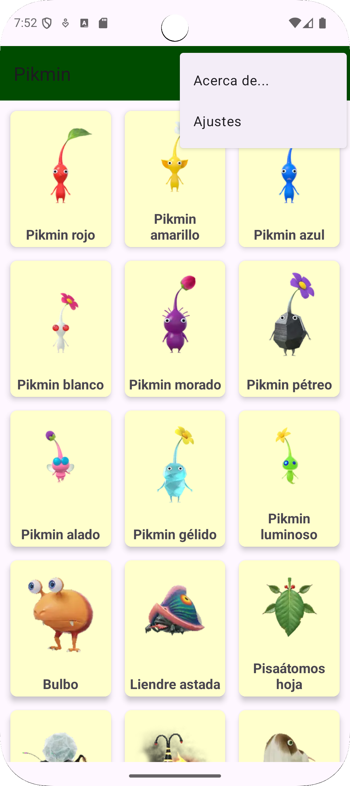

# 🌱 Aplicación Pikmin - Android

Aplicación Android que muestra una **lista de Pikmin** y permite consultar los **detalles** de cada uno.  
Incluye una **toolbar** con las opciones **"Acerca de"** y **"Ajustes"**, con un diseño limpio y responsivo.

---

## 📸 Capturas de pantalla

| Lista de Pikmin | Detalle del Pikmin | Menú de opciones |
|------------------|--------------------|------------------|
|  |  |  |

---

## 📱 Características principales

- **Lista de Pikmin:** muestra un `RecyclerView` con nombre, tipo e imagen de cada Pikmin.  
- **Pantalla de detalles:** al pulsar un Pikmin, se abre una `Activity` con su descripción e imagen ampliada.  
- **Toolbar con menú:**  
  - **Acerca de:** muestra información del autor o de la app.  
  - **Ajustes:** permite modificar configuraciones básicas del usuario.  
- **Diseño adaptativo:** interfaz optimizada para distintos tamaños de pantalla.

---

## 🧩 Tecnologías utilizadas

- **Lenguaje:** Kotlin  
- **Entorno:** Android Studio  
- **Componentes:**  
  - `RecyclerView`  
  - `View Binding`  
  - `Intent` y `Bundle`  
  - `Toolbar` con menú XML  
  - `ConstraintLayout`  
  - Material Design Components  

---

## 📂 Estructura del proyecto

AndroidManifest.xml

java/dam/pmdm/tarea2_gutierrezruiz_francisco/AjustesActivity.kt
java/dam/pmdm/tarea2_gutierrezruiz_francisco/DetallePikminActivity.kt
java/dam/pmdm/tarea2_gutierrezruiz_francisco/MainActivity.kt
java/dam/pmdm/tarea2_gutierrezruiz_francisco/Pikmin.kt
java/dam/pmdm/tarea2_gutierrezruiz_francisco/PikminAdapter.kt

res/font/bebas_neue.ttf
res/font/bitcount.ttf
res/font/pikminneue.otf

res/layout/activity_ajustes.xml
res/layout/activity_detalle_pikmin.xml
res/layout/activity_main.xml
res/layout/item_layout.xml

res/menu/menu.xml

res/values-en/strings.xml
res/values/strings.xml
res/values/strings.xml
res/values-en/strings.xml

res/values/themes.xml
res/values-night/themes.xml
res/values/themes.xml
res/values-night/themes.xml

res/values/colors.xml

res/values/styles.xml

---

## 🚀 Ejecución del proyecto

1. Clona el repositorio:
   ```bash
   git clone https://github.com/pacoguti71/Tarea2_GutierrezRuiz_Francisco.git
2. Abre el proyecto con Android Studio.
3. Espera la sincronización de Gradle.
4. Ejecuta la aplicación en un emulador o dispositivo físico con Android 8.0 o superior.

🧠 Conceptos reforzados

Este proyecto refuerza el uso de:
- Arquitectura de una app Android con varias Activities.
- Implementación de listas dinámicas mediante RecyclerView y adaptadores personalizados.
- Comunicación entre Activities mediante Intent y Bundle.
- Creación y manejo de menús con Toolbar.
- Diseño de interfaz con XML y principios de Material Design.

🧑‍💻 Autor

Francisco Gutiérrez Ruiz
📚 Estudiante de Informática | 🚕 Taxista | 💻 Creador de Código para Todos

🪴 Licencia

Este proyecto se distribuye bajo la licencia...
